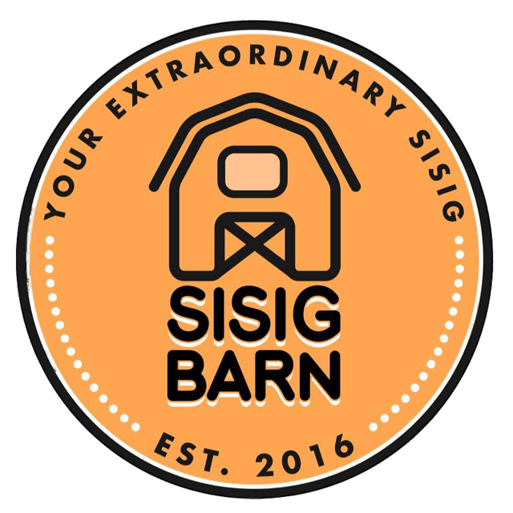

<div style="width: 100%; text-align: center;">
  
</div>

# Kiosk RESTful API

RESTful API for Sisig Bam (Kiosk and Dashboard)

### Installation

PHP, MySQL, Composer must be installed on your system

```
git clone https://github.com/lrdnnsjr/kiosk_api

composer install

cp env.example .env

php artisan key:generate

php artisan migrate

php artisan db:seed

php artisan serve
```

## References

-   [PHP](https://www.php.net/)
-   [Laravel](https://laravel.com/)
-   [Composer](https://getcomposer.org/)
